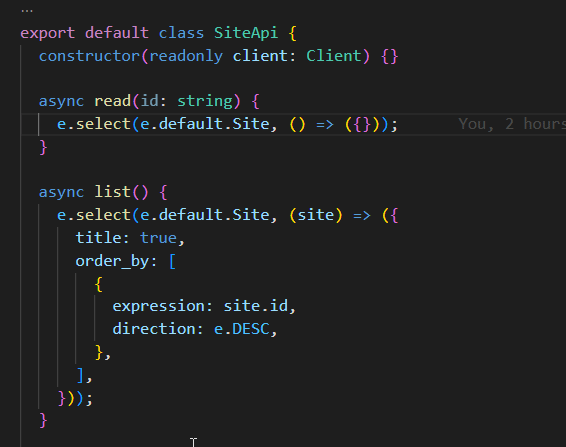

# README

## Steps

```sh
git clone https://github.com/juanrgm/edgedb-ts-bug.git
cd edgedb-ts-bug
pnpm i
edgedb project init --non-interactive
edgedb migration create
edgedb migration apply
npx edgedb
code --disable-extensions .
```

Go to this [line](https://github.com/juanrgm/edgedb-ts-bug/blob/main/src/index.ts#L8) in VSCode and...


